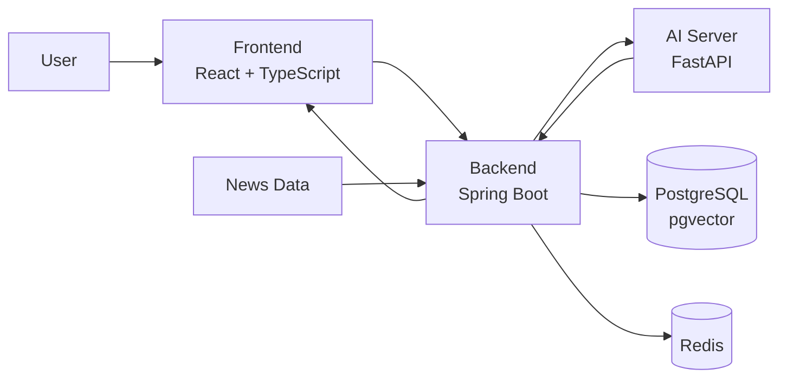
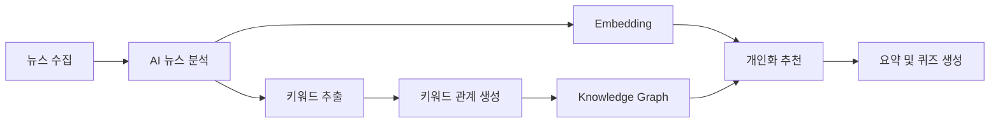

🦕 Nodingo
뉴스를 읽는 것에서, 탐험하는 것으로.
관심사 기반 키워드 그래프를 탐색하며 뉴스의 맥락을 이해하고,
퀴즈와 성장 요소를 통해 뉴스 소비를 하나의 경험으로 만드는 서비스입니다.

📌 About Nodingo
텍스트 뉴스는 중요한 정보를 담고 있지만,
많은 사람에게 여전히 어렵고 지루하게 느껴집니다.
Nodingo는 여기서 출발했습니다.
"뉴스가 조금 더 재미있을 수는 없을까?"

단순히 기사를 추천하거나 요약하는 것을 넘어,
뉴스 속 핵심 키워드와 이슈 간 관계를 그래프로 연결하고
사용자가 직접 탐색하면서 맥락을 이해할 수 있도록 구성했습니다.
또한 관심사 기반 추천, 퀴즈, 경험치와 랭킹 등
게임의 성장 요소를 결합해
뉴스를 수동적으로 읽는 경험에서 능동적으로 탐험하는 경험으로 바꾸고자 했습니다.
🎯 Problem
기존 뉴스 서비스에서는 다음과 같은 문제에 주목했습니다.
- 긴 텍스트 중심의 뉴스 소비는 진입 장벽이 높습니다.
- 개별 기사만으로는 사건과 이슈 사이의 맥락을 파악하기 어렵습니다.
- 추천받은 뉴스를 읽는 것만으로는 지속적으로 서비스를 탐색할 동기가 부족합니다.
Nodingo는 이를 다음과 같이 해결하고자 했습니다.
관심사 → 뉴스 → 키워드 → 관계 → 탐색 → 학습
사용자가 하나의 뉴스에서 출발해
관련된 키워드와 이슈를 자연스럽게 따라가며
뉴스의 배경과 연결 관계를 이해하는 경험을 설계했습니다.
✨ Key Features
1. 관심사 기반 온보딩
사용자가 관심 있는 분야와 키워드를 선택하면,
이를 기반으로 개인화된 뉴스 키워드와 콘텐츠를 제공합니다.
2. 뉴스 키워드 그래프
뉴스에서 추출한 핵심 키워드와 키워드 간 관계를
그래프 형태로 시각화합니다.
사용자는 그래프의 노드를 직접 탐색하며
서로 다른 뉴스와 이슈가 어떻게 연결되는지 확인할 수 있습니다.
3. AI 기반 뉴스 분석
수집된 뉴스에 대해 AI 분석을 수행하여
- 핵심 키워드 추출
- 뉴스 요약
- 키워드 간 관계 분석
- 뉴스 및 키워드 임베딩
등의 정보를 생성하고,
이를 지식 그래프와 추천에 활용합니다.
4. 개인화 추천
사용자가 선택한 관심사와 키워드 임베딩을 바탕으로
그날의 뉴스 키워드 중 관심도가 높은 주제를 추천합니다.
5. 게임형 뉴스 탐색
뉴스 소비가 일회성으로 끝나지 않도록
- 키워드 탐험
- 뉴스·키워드 스크랩
- 퀴즈
- 경험치(XP)
- 주간 리더보드
등의 요소를 결합했습니다.
뉴스를 읽는 행위가
사용자가 자신의 관심 영역을 넓혀가는 성장 경험이 되도록 설계했습니다.
🏗 System Architecture

Nodingo는 Frontend - Backend - AI Server를 분리하여 구성했습니다.
Backend에서 뉴스를 수집하고 AI Server에 분석을 요청하면,
AI Server가 뉴스 요약·키워드·임베딩·관계 정보를 생성합니다.
분석된 데이터는 데이터베이스에 저장된 뒤
키워드 그래프, 개인화 추천, 요약, 퀴즈 등의 기능에 활용됩니다.
🤖 AI & News Pipeline

뉴스는 정기적으로 수집되며,
AI 분석을 통해 뉴스와 키워드를 구조화합니다.
Backend에서는 분석 결과를 바탕으로
뉴스-키워드 관계와 키워드 간 관계를 저장하고,
사용자의 관심사와 당일 키워드의 유사도를 비교해
개인화된 추천을 생성합니다.
추천된 키워드에 대해서는
관련 뉴스를 바탕으로 요약과 퀴즈를 생성합니다.
🛠 Tech Stack
Frontend
- React 18
- TypeScript
- Vite
- TanStack Query
- Zustand
- Axios
- CSS Modules
Backend
- Java 21
- Spring Boot 3
- Spring Batch
- Spring Data JPA
- QueryDSL
- PostgreSQL
- pgvector
- Redis
- Spring Security / OAuth2 / JWT
- Firebase Cloud Messaging
AI
- Python
- FastAPI
- PyTorch
- Transformers
- Sentence Transformers
- KeyBERT
- scikit-learn
- pandas / NumPy
📂 Repositories
Repository	Description
nodingo-frontend	사용자 인터페이스 및 키워드 그래프·온보딩 구현
nodingo-backend	API, 데이터베이스, 뉴스 배치 처리, 추천 및 서비스 로직
nodingo-ai-models	뉴스 분석, 임베딩, 키워드 및 관계 추출 등 AI 서비스
nodingo-Onboarding	온보딩 관련 구현 저장소

각 Repository의 세부 구조와 실행 방법은
해당 Repository의 README에서 확인할 수 있습니다.
🔄 Service Flow
1. 사용자가 관심 분야와 키워드를 선택합니다.
2. 새로운 뉴스가 정기적으로 수집됩니다.
3. AI Server가 뉴스의 요약·키워드·임베딩·관계를 분석합니다.
4. 분석된 키워드와 뉴스 관계를 그래프로 구성합니다.
5. 사용자의 관심사와 당일 키워드를 비교해 개인화 추천을 생성합니다.
6. 사용자는 그래프를 탐색하며 관련 뉴스의 맥락을 확인합니다.
7. 퀴즈, 스크랩, XP 등의 기능을 통해 관심 영역을 지속적으로 확장합니다.
💡 What We Tried to Build
Nodingo가 만들고자 한 것은
또 하나의 뉴스 요약 서비스가 아닙니다.
뉴스를 하나씩 소비하는 대신,
서로 연결된 정보를 탐색하며
사용자가 스스로 관심 분야의 맥락을 쌓아가는 경험을 만들고자 했습니다.
Read less like a feed. Explore more like a map.
